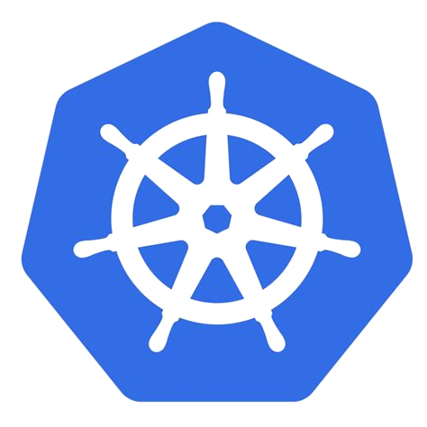
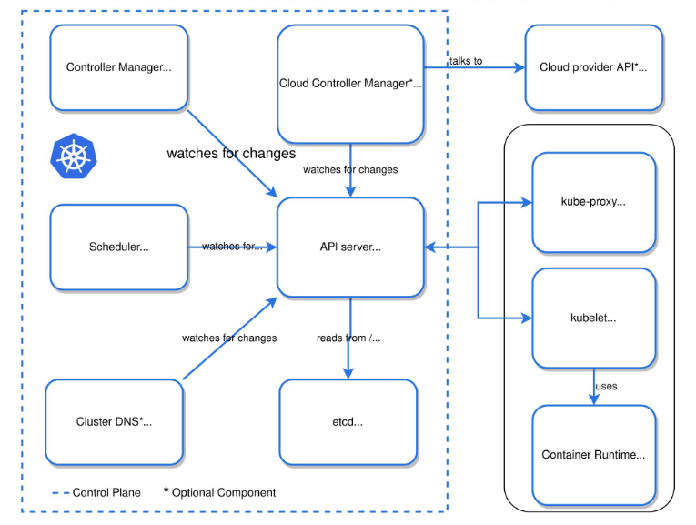
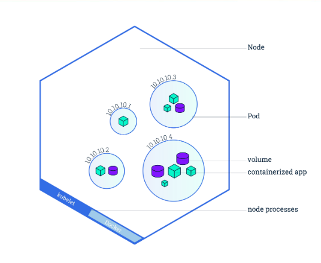
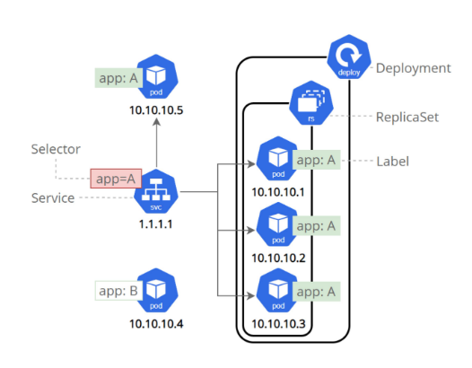

<link href="css/style.css" rel="stylesheet">

# Kubernetes



---

## Sommaire

### 1. Contexte
### 2. Architecture
### 3. Workloads

---

## Contexte
<!-- .slide: class="big-slide" -->

- Créé par Google en 2014 à partir de leur propre solution, Borg
- Sert de base de création à la CNCF (<em>Cloud Native Computing Foundation</em>)
- Écrit en Golang
- Proposé dans des solutions de cloud publics (GCP, AWS, Azure, OVH, ...) et de clouds privés (Openshift, Rancher, ...)
- Plateforme d'orchestration de conteneur

<iframe data-src="https://www.cncf.io/projects/" width=100% height=100%></iframe>

---

## Orchestration de conteneurs, kesako ?

L'orchestration c'est :
- l'automatisation du déploiement
- l'automatisation de la montée en charge
- la mise en œuvre de conteneurs applicatifs sur des clusters de serveurs

---
## Ce que peut faire Kubernetes

- Répartisseur de charge et découverte de services
- Orchestration de stockage
- Rollback et rollout de nouvelles versions automatiques
- Optimisation des ressources
- Auto-réparation
- Gestion de configuration et de secrets applicatifs

---
# Architecture

---

## Control Plane
<!-- .slide: class="big-slide" -->


- Nodes master (abstraits dans les offres cloud publics managées)
- Nodes worker

---

## Composition du control plane
<!-- .slide: class="big-slide" -->

- <b>Etcd</b>
    - Persistence des données du cluster : clé/valeur distribuée, protocole RAFT
- <b>APIServer</b>
    - Serveur qui permet la configuration d’objet Kubernetes (Pods, Service, Replication Controller, ...)
    - Tous les communications du cluster passent par l’API Server
    - Gère l’authentification, l’autorisation, la validation de la demande, le contrôle d’admission
- <b>Controller Manager</b>
    - Gère les différents contrôleurs du cluster (NodeController, ReplicationController, EndpointController, ...)
- <b>Scheduler</b>
    - S’occupe de trouver un noeud pour déployer un POD

---

## Composition des nodes
<!-- .slide: class="big-slide" -->

- <b>Kubelet</b>
    - Crée et gère les conteneurs. Contacté par l’API Server
- <b>Kube-proxy</b>
    - Gère les règles réseaux sur chaque noeud
    - Forwarding TCP/UDP et Load balancing entre les services et les backends
- <b>Container Runtime Interface (CRI)</b>
    - Exécute les conteneurs : Containerd (default), Cri-o, gVisor, Kata, Docker (Deprecated)
- <b>Container Network Interface (CNI)</b>
    - Allocation des adresses IP des conteneurs
    - Gestion de l’interface réseau qui va porter le conteneur
    - Cilium (GKE v2), Flannel, Weave, ...
- <b>Container Storage Interface (CSI)</b>
    - Création, redimensionnement, attachement, montage [...] des volumes
    - Secrets

---

## Architecture



---

# Installation d'un cluster Kubernetes de test

---
## Outillages

- Kubectl
```bash
curl -LO "https://dl.k8s.io/release/$(curl -L -s https://dl.k8s.io/release/stable.txt)/bin/linux/amd64/kubectl"
chmod +x kubectl
mkdir -p ~/bin
mv ./kubectl ~/bin/kubectl
# Append ~/bin to your PATH
# Install bash or zsh completions
kubectl completion bash
```
- Vagrant
```bash
curl -LO "https://releases.hashicorp.com/vagrant/2.2.19/vagrant_2.2.19_linux_amd64.zip"
unzip vagrant_2.2.19_linux_amd64.zip
chmod +x vagrant
mv vagrant ~/bin
rm vagrant_2.2.19_linux_amd64.zip
```

- Virtualbox

---

## Installation de Kubernetes

- Configuration Virtualbox
```bash
sudo mkdir -p /etc/vbox/
echo * 0.0.0.0/0 ::/0 | sudo tee -a /etc/vbox/networks.conf
```

- Installation via Vagrant
```bash
git clone https://github.com/scriptcamp/vagrant-kubeadm-kubernetes.git
cd vagrant-kubeadm-kubernetes
vagrant up
```

- Copie des creds
```bash
cp config ~/.kube/
```

---

## Vérification de l'installation

- Apiserver
```bash
vagrant ssh
kubectl cluster-info
kubectl get nodes
```

- Dashboard
```bash
TOKEN=$(kubectl -n kubernetes-dashboard describe secrets admin-user-token | awk '$1=="token:"{print $2}')
kubectl config set-credentials kubernetes-admin --token="${TOKEN}"
kubectl proxy
# http://localhost:8001/api/v1/namespaces/kubernetes-dashboard/services/https:kubernetes-dashboard:/proxy/#/workloads?namespace=default et se logger avec .kube/config
```

---

# Workloads

---

## Pods
<div class="row">
    <div class="column">
        <ul>
            <li>C’est la plus petite unité schedulable</li>
            <li>Un pod est composé de 1 à N conteneurs</li>
            <li>Conteneurs:</li>
            <ul>
                <li>Même namespace réseau (127.0.0.1)</li>
                <li>Partage un espace de stockage commun</li>
            </ul>
            <li>Pod solitaire :</li>
            <ul>
                <li>Aucun contrôle up/running</li>
                <li>Il faut créer un Workload</li>
            </ul>
        </ul>
    </div>
    <div class="column">
        
    </div>
</div>


---

## Workloads

- <b>Deployment</b>
    - Probablement le workload le plus utilisé dans Kubernetes
    - S’occupe du rolling update des pods lors d’un update (par un ReplicaSet)
- <b>StatefulSet</b>
    - Utilisé pour les applications avec état (cache, écriture disque, clustering, ...)
    - Chaque pod a un identifiant persistant qu'il conserve lors de toute replanification
- <b>DaemonSet</b>
    - Place exactement 1 pod par node
    - Utile pour les agents de logging par exemple
- <b>Cronjob / Job</b>
    - Action ponctuelle ou répétitive

---

## Requests Limits

- Mécanismes utilisés pour contrôler les ressources processeur et la mémoire.
- <b<Requests</b> :
    - Garanti pour le conteneur
    - Le conteneur sera planifié que sur un nœud qui peut lui donner cette ressource.
- <b>Limits</b> :
    - Le conteneur ne dépasse jamais une certaine valeur.
    - OOMKilled

---

## Probes

- Kubelet :
    - `liveness` : pour détecter si le pod est vivant
    - `readiness` : pour savoir si le pod est prêt à accepter le trafic
- Gèle le rolling update si l’application : ne démarre pas ou n’est pas prête
- Ne pas vérifier les éléments externes de l’application
    - Memcached, DB, etc ..

---

## Configmap et secrets

- <b>Configmap</b> : pour stocker et de gérer des informations
- <b>Secrets</b> : pour stocker et gérer des informations sensibles (Base 64 !!!)
- Utilisation :
    - variables d’environnements
    - volumes

---

## Storage

- <b>StorageClass</b> : définit plusieurs offre de stockage
    - des niveaux de qualité de service
    - des politiques de sauvegarde
- <b>PersistentVolume</b> :
    - élément de stockage dans le cluster
    - provisionné par un administrateur ou provisionné dynamiquement à l'aide de Storage Classes
- <b>PersistentVolumeClaim</b> : est une demande de stockage par un utilisateur
    - une taille
    - des modes d'accès spécifiques

---

## Services

<div class="row">
    <div class="column">
        <ul>
            <li>Définit un ensemble logique de pods</li>
            <li>Stratégie permettant d’y accéder</li>
            <li>Types de Service</li>
            <ul>
                <li>None</li>
                <li>ClusterIP</li>
                <li>NodePort</li>
                <li>LoadBalancer</li>
            </ul>
        </ul>
    </div>
    <div class="column">
        
    </div>
</div>

---

## Ingress

- Expose les routes HTTP et HTTPS de l'extérieur du cluster à
des services au sein du cluster
- Routage du trafic est contrôlé par des règles définies sur la
ressource Ingress.
- Ingress Controller : Nginx, Traefik, Contour, HAProxy Ingress

---

## Namespaces

- Isolation logique des objets kubernetes
    - Par défaut les namespaces :
        - default
        - kube-system
            - kube-dns
            - kube-proxy
- On peut :
    - Limiter les ressources allouées (CPU / Memory / Pods..)
    - “Isoler” des groupes de pods / domaines métiers
- Bonne pratique :
    - Ne pas mettre les objets K8S dans le namespace default